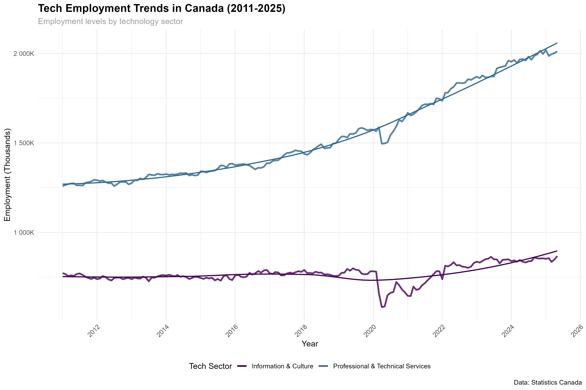
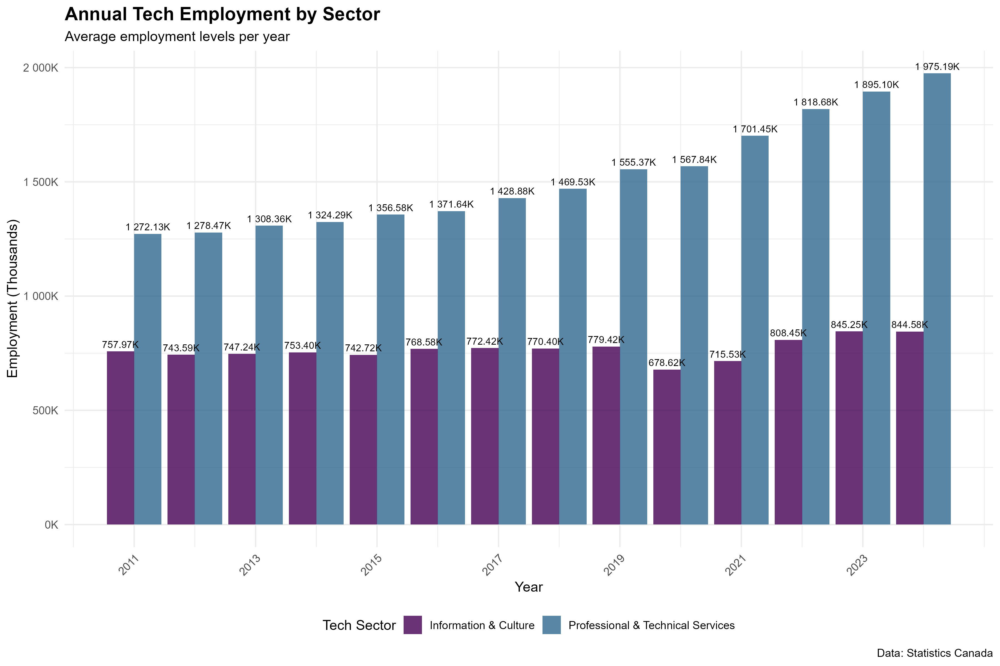
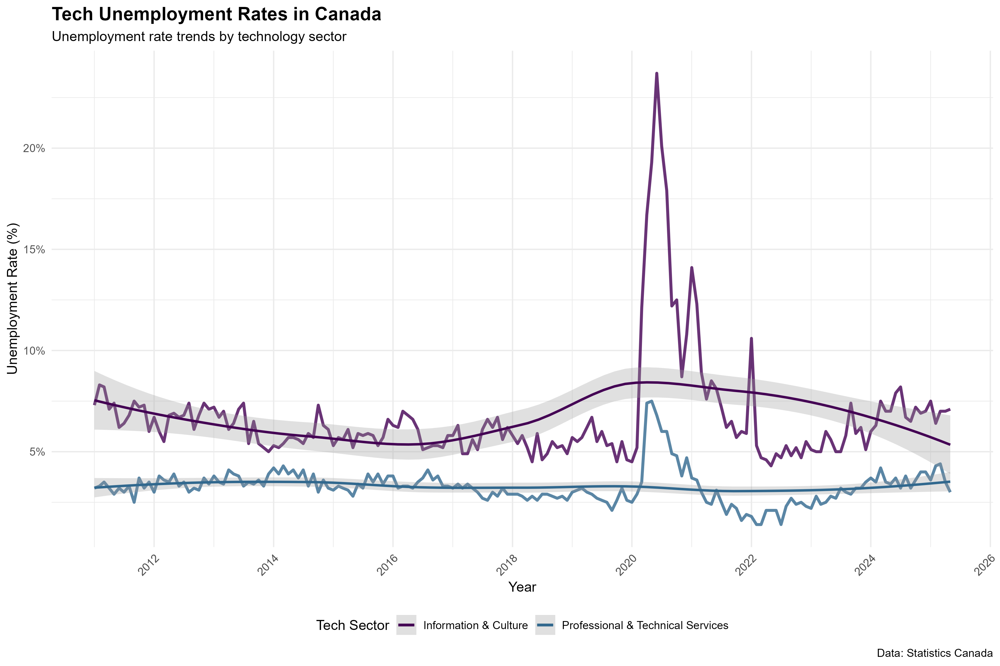
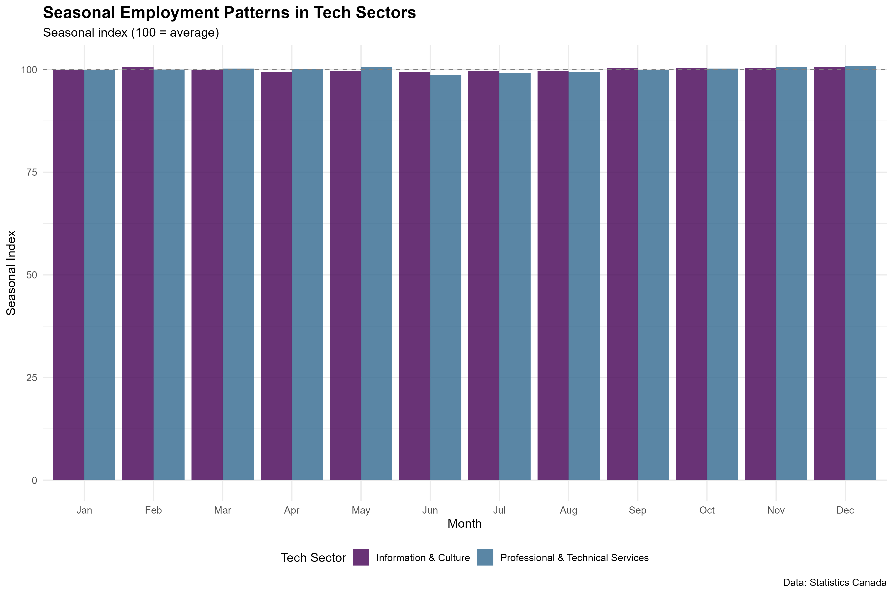
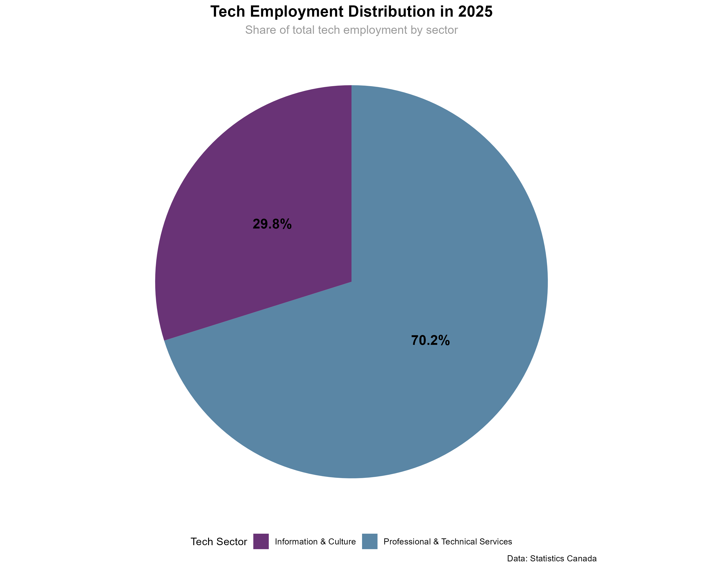
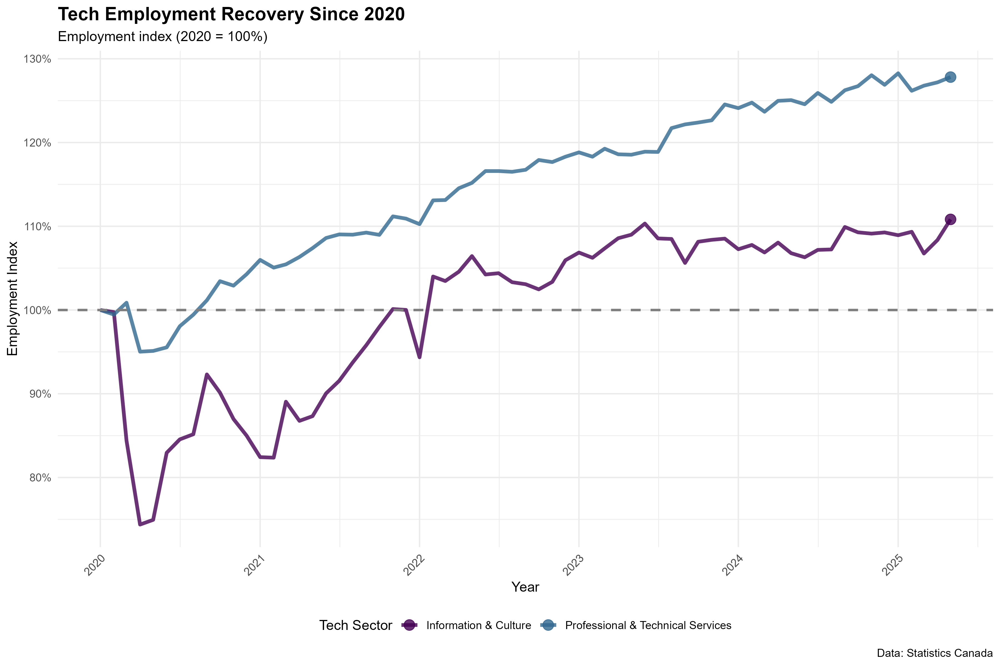
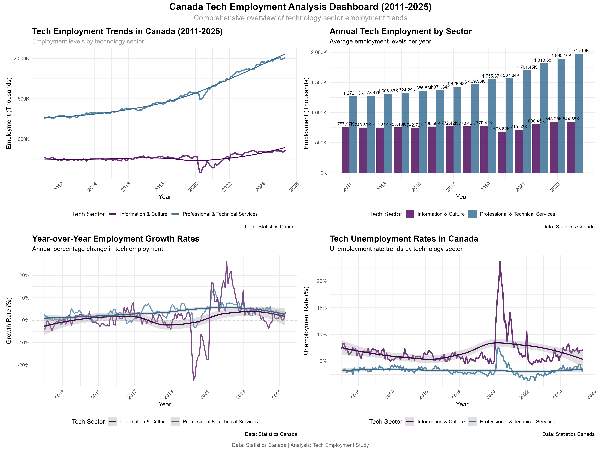
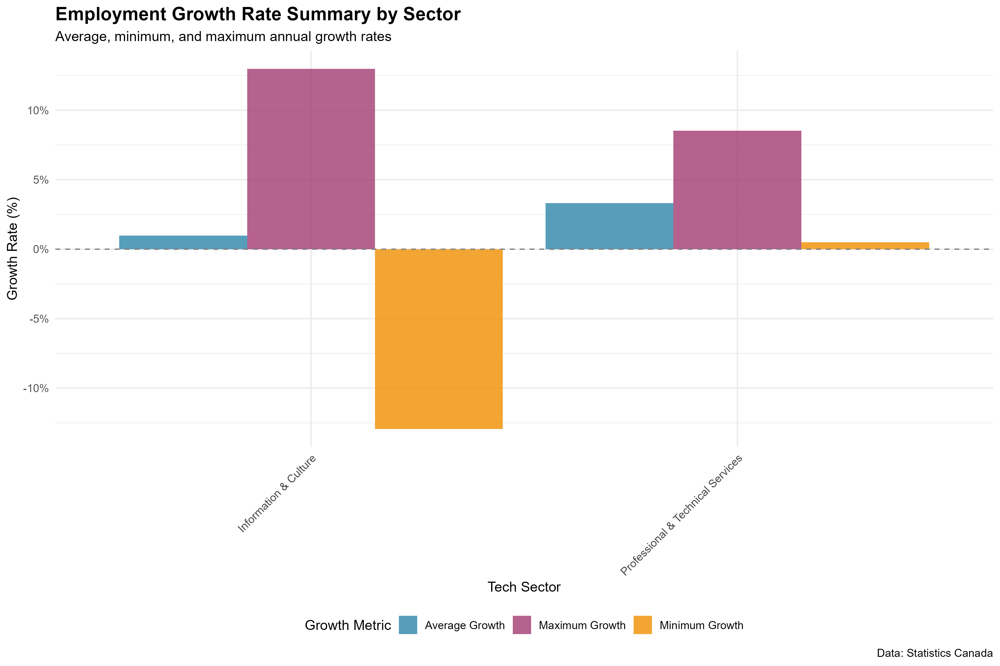

# Canada Tech Workforce Analysis

I got curious about how Canada's tech sector has evolved over the past decade and decided to dig into the data. Using publicly available datasets from Statistics Canada and ICTC labour reports, I analyzed employment trends from 2011 to 2025 to see which provinces are driving growth, how wages have changed, and what patterns emerged through the pandemic.

This is part of my data analysis portfolio, where I'm building hands-on experience with R, data visualization, and telling stories with numbers.

## What I'm Looking At

I wanted to answer a few straightforward questions:
- How has tech employment changed across Canada over the last 14 years?
- Which provinces are leading the way in tech job creation?
- How have wages in tech compared to other sectors?
- What impact did the pandemic have on the industry?

To tackle this, I used R with packages like tidyverse, ggplot2, and dplyr. The data comes from Statistics Canada's labour force surveys (NAICS 54 – Professional, Scientific and Technical Services) and various ICTC reports.

## What's in This Repo

Here's how everything is organized:

- **data/** – The raw and cleaned datasets I worked with
- **visuals/** – All the charts and graphs generated from the analysis
- Scripts for data cleaning, analysis, and visualization (`.R` files in the root)

## Key Findings

After working through the data, a few things stood out:

Employment in software, data, and engineering roles has jumped by over 60% since 2011. That's pretty significant growth, especially when you compare it to other sectors. Ontario, BC, and Quebec are clearly the heavyweights – they dominate Canada's tech landscape. The Prairie provinces (Alberta, Manitoba, Saskatchewan) are showing steady but more modest growth.

Wage growth in tech has been strong too, outpacing the national average by about 20%. Post-pandemic, things have stabilized somewhat, though there's still growth in cloud computing and AI-related positions.

## The Visuals

**Employment Trends Over Time (2011–2025)**

This chart shows the overall trajectory of tech employment across Canada. You can see the steady upward trend with a slight dip around 2020 (hello, pandemic), followed by recovery.



**Growth Rates by Year**

Looking at year-over-year growth rates, you can spot which periods saw the biggest jumps and where things cooled off a bit.


**Annual Comparison by Province**

Here's how different provinces stack up against each other. Ontario and BC are clearly out in front, but you can see where other provinces fit in.



**Unemployment Rates in Tech**

Unemployment in tech has generally been lower than the national average, though there were some fluctuations during economic uncertainty.



**Seasonal Employment Patterns**

Tech employment shows some seasonal variation, though it's less pronounced than in other industries. Interesting to see how hiring patterns shift throughout the year.



**Sector Distribution (NAICS 54)**

Breaking down the Professional, Scientific and Technical Services sector shows where the jobs are concentrated – software development, computer systems design, and scientific research lead the pack.



**Post-Pandemic Recovery**

The rebound after COVID-19 has been fairly strong, with tech proving to be more resilient than many other sectors.



**Comprehensive Dashboard**

I put together this dashboard to see everything at once – trends, distributions, and key metrics all in one place.



**Growth and Wage Summary**

This summary view captures both employment growth and wage trends, giving you the big picture of how the sector has evolved.



There's also an interactive HTML dashboard in the visuals folder if you want to explore the data more dynamically.

## Data Sources

All the data used here is publicly available:

- [Statistics Canada – Labour Force Survey (Table 14-10-0200-01)](https://www150.statcan.gc.ca/t1/tbl1/en/tv.action?pid=1410020001)
- [ICTC – Information and Communications Technology Council Reports](https://www.ictc-ctic.ca/research-reports/)
- [Government of Canada Open Data Portal](https://open.canada.ca/en/open-data)

I accessed these datasets in 2024, and they're all free to use for educational and research purposes.

## Running This Yourself

If you want to replicate the analysis or explore the code:

1. Clone the repository:
   ```bash
   git clone https://github.com/Mahmoud3Ibrahim/canada-tech-workforce-analysis--R-
   cd canada-tech-workforce-analysis--R-
   ```

2. Make sure you have R installed, then install the required packages:
   ```r
   install.packages(c("tidyverse", "dplyr", "ggplot2", "lubridate", "readr"))
   ```

3. Run the scripts in this order:
   - `Data Cleaning.R` – cleans and prepares the datasets
   - `Tech Employment Analysis.R` – performs the exploratory analysis
   - `Tech Employment Visualization Script.R` – generates all the charts

The visualizations will be saved in the `/visuals/` folder.

## What's Next

I'm planning to expand this analysis in a few ways:
- Build some regression models to explore the relationship between wages and employment growth more formally
- Add time-series forecasting to project tech job demand beyond 2025
- Create an interactive dashboard (probably using Shiny or Power BI) for easier exploration
- Look into how immigration trends might be tied to workforce patterns

## About Me

I'm **Mahmoud Ibrahim**, based in Ottawa, working on building my skills in data analysis and web development. This project is part of my portfolio as I transition into data-focused roles.

Feel free to connect with me on [LinkedIn](https://www.linkedin.com/in/mahmoud3ibrahim) if you want to chat about the project or data analysis in general.

## License

MIT License – feel free to use this for your own learning or projects.
