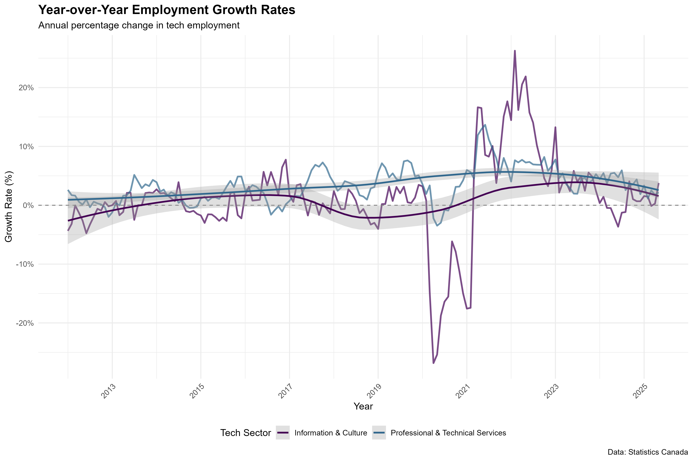

# Canada Tech Workforce Analysis

I've always been curious about how Canada's tech industry has evolved over the years. With all the talk about tech booms, layoffs, and the rise of AI, I wanted to dig into the actual numbers and see what's really happening with tech employment across the country.

This analysis looks at tech workforce trends from 2011 to 2025, examining which provinces are leading the charge in job creation and how wages have shifted over time. I used publicly available data from Statistics Canada and ICTC labour market reports to piece together the story.

---

## What I Set Out to Do

I wanted to understand three main things:
- How much has tech employment actually grown since 2011?
- Which Canadian provinces are creating the most tech jobs?
- How have tech salaries changed compared to other industries?

To answer these questions, I worked with R using tidyverse, ggplot2, and a bunch of other libraries to clean, analyze, and visualize the data. The process involved three main steps: gathering and cleaning the data, exploring patterns through visualization, and pulling out meaningful insights.

---

## Project Files

Here's how everything is organized:

```
data/          Raw and cleaned datasets
visuals/       All the charts and visualizations
*.R files      R scripts for data cleaning, analysis, and creating visuals
```

---

## What I Found

After crunching the numbers, a few patterns really stood out:

**Employment growth has been impressive.** Since 2011, jobs in software, data, and engineering roles have grown by more than 60%. That's substantial growth over a 14-year period.

**Geography matters.** Ontario, British Columbia, and Quebec dominate the tech employment landscape. That's not surprising given Toronto, Vancouver, and Montreal are tech hubs, but the data confirms just how concentrated tech jobs are in these provinces.

**The Prairies are holding steady.** Alberta, Manitoba, and Saskatchewan show moderate but consistent growth. They're not explosive numbers, but they're reliable.

**Tech wages are outpacing other sectors.** Salaries in tech fields have grown about 20% faster than the national average. For people looking at career paths, that's meaningful.

**Post-pandemic stabilization.** After the chaos of 2020-2021, the data shows things have leveled out. There's still expansion happening, especially in cloud computing and AI-related roles, but it's more measured now.

---

## The Visuals

Here's what the data looks like when you map it out. Each chart tells part of the story:

### Employment Trends Over Time (2011–2025)
This shows the overall trajectory of tech employment. You can see the steady climb, with a noticeable acceleration after 2015.


### Year-Over-Year Growth Rates
Some years had explosive growth, others were more modest. This chart breaks down the annual changes.



### Provincial Comparison
Where are the tech jobs? This visualization compares employment across provinces year by year.


### Unemployment in the Tech Sector
Even in a growing sector, unemployment rates fluctuate. Here's how they've changed over time.


### Seasonal Patterns
Interestingly, tech employment shows some seasonal variation. This chart captures those patterns.


### Sector Breakdown (NAICS 54)
Not all tech jobs are the same. This breaks down employment by specific sectors within the professional services category.


### Post-Pandemic Recovery
What happened after COVID-19? This focuses on recent trends and recovery patterns.


### Comprehensive Dashboard
All the key metrics in one place. This dashboard gives you the big picture at a glance.


### Growth and Wage Summary
Finally, here's how employment growth and wage growth stack up against each other.


You can also check out the `/visuals` folder for an interactive HTML version with more detailed charts.

---

## Data Sources

All the data for this analysis comes from publicly available sources:

- **Statistics Canada** – Labour Force Survey (Table 14-10-0200-01)  
  [View the data](https://www150.statcan.gc.ca/t1/tbl1/en/tv.action?pid=1410020001)

- **ICTC** – Information and Communications Technology Council Reports  
  [Access reports](https://www.ictc-ctic.ca/research-reports/)

- **Government of Canada Open Data Portal**  
  [Browse datasets](https://open.canada.ca/en/open-data)

I accessed these datasets in 2024. They're available for anyone to use for educational and analytical purposes.

---

## Running This Locally

Want to explore the data yourself? Here's how to get started:

**1. Clone the repository**
```bash
git clone https://github.com/Mahmoud3Ibrahim/canada-tech-workforce-analysis--R-
cd canada-tech-workforce-analysis--R-
```

**2. Install the required R packages**
```r
install.packages(c("tidyverse", "dplyr", "ggplot2", "lubridate", "readr"))
```

**3. Run the scripts in this order:**
- Start with `Data Cleaning.R` to prepare the datasets
- Then run `Tech Employment Analysis.R` for exploratory analysis  
- Finally, use `Tech Employment Visualization Script.R` to generate all the visuals

The charts will be saved to the `/visuals` folder.

---

## What's Next

There's more I'd like to explore with this data:

- **Statistical modeling** – I want to test whether there's a significant relationship between wage growth and employment growth using regression models.

- **Time-series forecasting** – Predicting tech job demand beyond 2025 would be interesting, especially with AI changing the landscape.

- **Interactive dashboard** – I'm planning to build a Power BI dashboard that makes it easier to explore these trends interactively.

- **Immigration data** – Canada's tech sector relies heavily on immigration. Connecting that data to workforce trends could reveal some interesting patterns.

---

## About Me

I'm **Mahmoud Ibrahim**, based in Ottawa, Canada. I work in data analysis and web development, and I'm always looking for interesting datasets to explore. If you want to connect or have questions about this analysis, you can find me on [LinkedIn](https://www.linkedin.com/in/mahmoud3ibrahim).

---

## License

This project is available under the MIT License. Feel free to use it for your own learning or analysis.
